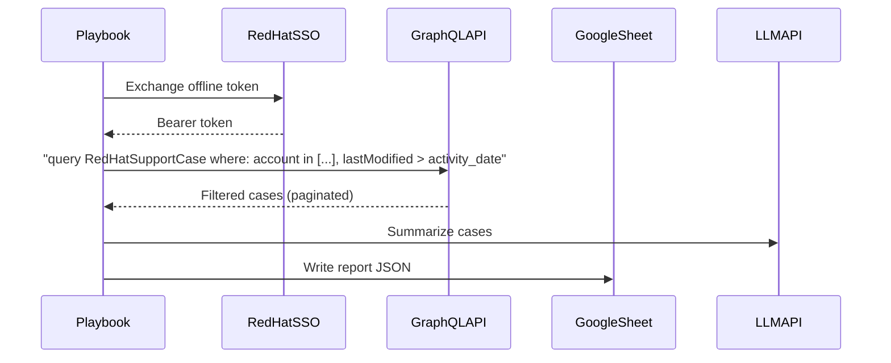

# Data Flow — Support Case Analyzer

How `playbooks/pb_analyze_support_cases.yml` interacts with external services.

## Flow

1. **SSO token exchange** — offline token to bearer token, via the token-exchange task in
   `playbooks/pb_analyze_support_cases.yml`.
2. **GraphQL fetch** — `business.support.graphql_cases` posts a single query per account config
   (see [tasks/account_analyze.yml](../../tasks/account_analyze.yml)), filtering by account
   number(s) and `activity_date` server-side. Cursor-based pagination collects all matching cases
   automatically (max 200 per page).
3. **LLM summarize** — case data sent to an OpenAI-compatible endpoint
   (`business.support.llm_summarize`) for AI insights.
4. **Report output** — [templates/support_case_analysis.md.j2](../../templates/support_case_analysis.md.j2)
   and [templates/support_case_analysis.json.j2](../../templates/support_case_analysis.json.j2)
   render markdown, JSON, and optionally PDF reports. Google Sheets is updated via
   `business.support.gsheet_update`.

See [../support-tracker/DATA_FLOW.md](../support-tracker/DATA_FLOW.md) for the tracker workflow's
data flow (which shares the SSO step but otherwise reads/writes a separate Google Sheet tab and
does not use an LLM).
