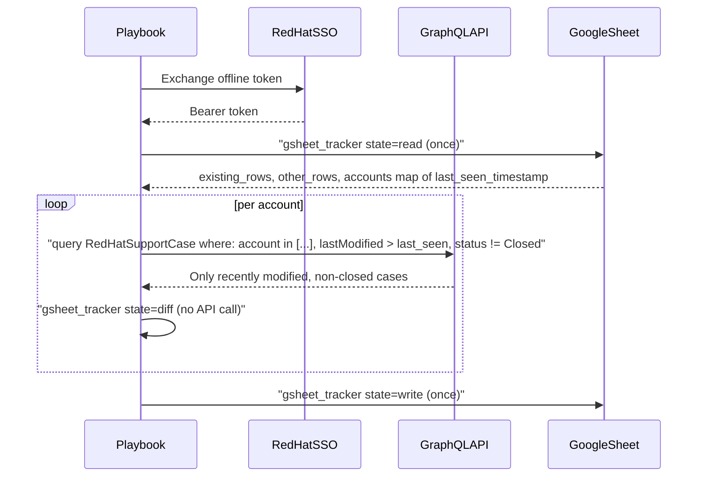

# Data Flow — Support Case Tracker

How `playbooks/pb_track_support_cases.yml` interacts with external services (one read + one
write for the whole run, regardless of account count).

## Flow

1. **SSO token exchange** — same as the analyzer, via the token-exchange task in
   `playbooks/pb_track_support_cases.yml`.
2. **Read previous state once for every account** — `business.support.gsheet_tracker` with
   `state: read` is called a single time (before the per-account loop, not inside it) and returns
   each account's `last_seen_timestamp`/`total_previous` plus `other_rows` (raw rows for accounts
   outside this run, preserved verbatim) and `existing_rows` (the full matrix, for the per-account
   diff step). A `tracker_last_run_date` extra var can override the cutoff; otherwise
   `activity_date` is the final fallback.
3. **GraphQL fetch (per account)** — `business.support.graphql_cases` with
   `include_description: false` and `status_filter: tracker_status_filter` (default
   `{ne: "Closed"}`) fetches only non-closed cases modified since the cutoff
   (see [tasks/account_track.yml](../../tasks/account_track.yml)), reducing payload size and
   ensuring closed cases fall out of the "active" set the diff compares against.
4. **Diff (per account, no API calls)** — `business.support.gsheet_tracker` with `state: diff`
   compares current cases against the relevant slice of `existing_rows`, returns
   new/closed/updated case lists, and builds that account's replacement rows (accumulated into a
   playbook-level fact).
5. **Write once** — after every account has been processed, `state: write` writes `other_rows` +
   every account's accumulated rows in a single clear+rewrite, and maintains a Sheets API Table
   (`gsheet_table_name`, defaults to `gsheet_sheet`) over the result.
6. **Email notification** — `community.general.mail` sends a change summary (rendered from
   [templates/support_case_tracking_email.html.j2](../../templates/support_case_tracking_email.html.j2))
   if any account has diffs (or always, when `tracker_notify_on_no_changes: true`).

See [../support-analyzer/DATA_FLOW.md](../support-analyzer/DATA_FLOW.md) for the analyzer
workflow's data flow (which shares the SSO step but writes to a different Google Sheet tab and
uses an LLM).
